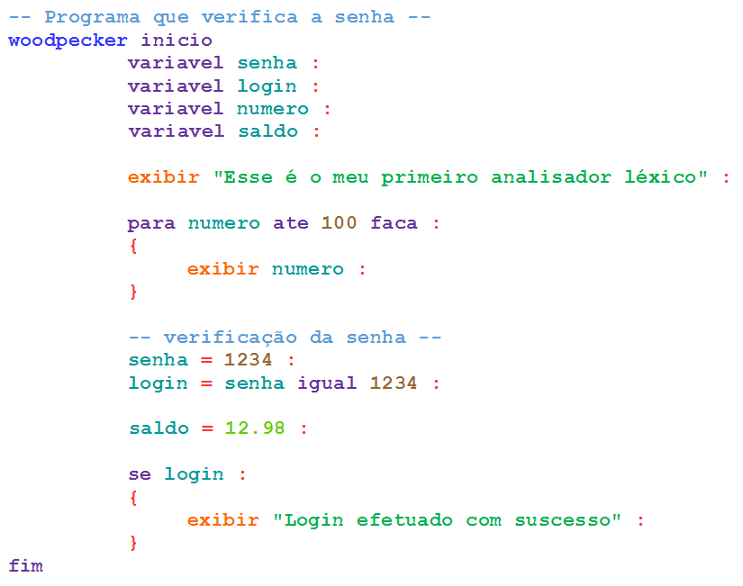

#### Woodpecker Lexical Analyzer

Woodpecker is a simple lexical analyzer written in Python used to explain a lexical convention on the study of compilers.

#### Lexical Specification

Source code

Conventions table

| Color   | Description                                |
|---------|--------------------------------------------|
| Blue    | Names of languages – keyword               |
| Purple  | Keyword                                    |
| Orange  | Identifier - procedure                     |
| Cyan    | Identifier - variable                      |
| Green   | String                                     |
| Brown   | Integer                                    |
| Lime    | Float                                      |
| ------- | Between -- -- is a comment                 |
| ------- | Left curly bracket - { - start block code  |
| ------- | Right curly bracket - } - end block code   |
| ------- | Colon - : - end <keyword> Statement        |
| ------- | Equal - = - variable assignment statements |

#### Files

`woodpecker.language`: Source code of programming language.

`woodpecker.py`: Implementation of the lexical analysis(scanning).

`test_woodpecker.py`: Unit test of the lexical specification.
